# Hearth Gateway - Backend (Second Iteration)

This repository now includes a fully functional FastAPI backend focused on the second-iteration requirements:

- REST API
- request logging
- CRUD operations
- security (JWT auth + role-based access)
- README evidence section for Postman flows

## Implemented backend features

### 1) Functionality (REST + CRUD)

Base URL: `http://localhost:8000`

- Health
  - `GET /health`
- Auth
  - `POST /api/v1/auth/login`
  - `POST /api/v1/auth/refresh`
  - `GET /api/v1/auth/me`
- Users
  - `GET /api/v1/users`
  - `POST /api/v1/users`
  - `GET /api/v1/users/{user_id}`
  - `PATCH /api/v1/users/{user_id}`
  - `DELETE /api/v1/users/{user_id}`
- Devices
  - `GET /api/v1/devices`
  - `POST /api/v1/devices`
  - `GET /api/v1/devices/{device_id}`
  - `PATCH /api/v1/devices/{device_id}`
  - `DELETE /api/v1/devices/{device_id}`
- Alerts
  - `GET /api/v1/alerts`
  - `POST /api/v1/alerts`
  - `GET /api/v1/alerts/{alert_id}`
  - `PATCH /api/v1/alerts/{alert_id}`
  - `DELETE /api/v1/alerts/{alert_id}`
- VPN Peers
  - `GET /api/v1/vpn-peers`
  - `POST /api/v1/vpn-peers`
  - `GET /api/v1/vpn-peers/{peer_id}`
  - `PATCH /api/v1/vpn-peers/{peer_id}`
  - `DELETE /api/v1/vpn-peers/{peer_id}`

### 2) Security

- Password hashing with bcrypt (`passlib`)
- JWT access + refresh tokens
- Bearer token authorization (`OAuth2PasswordBearer`)
- Role-based authorization:
  - `admin` can manage critical CRUD operations
  - regular `user` has restricted access
- Default admin bootstrap created at startup from `.env`

### 3) Logging

- Centralized logging configuration in `backend/app/core/logging.py`
- Request logging middleware includes:
  - HTTP method
  - path
  - status
  - duration
  - request id

## Run locally

1. Copy environment file:
   - `cp .env.example .env`
2. Install dependencies:
   - `cd backend`
   - `python3 -m venv .venv`
   - `source .venv/bin/activate`
   - `pip install -r requirements.txt`
3. Start API:
   - `uvicorn app.main:app --reload`
4. Open Swagger:
   - `http://localhost:8000/docs`

## Postman evidence (required screenshots)

> Replace the placeholders below with your actual captures before submission.

1. Login success (`200`)  
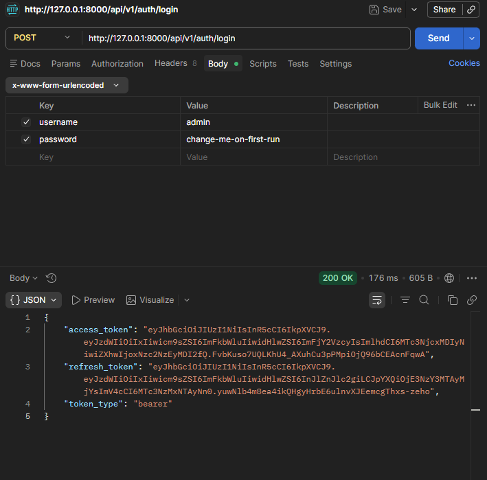

2. Login invalid password (`401`)  
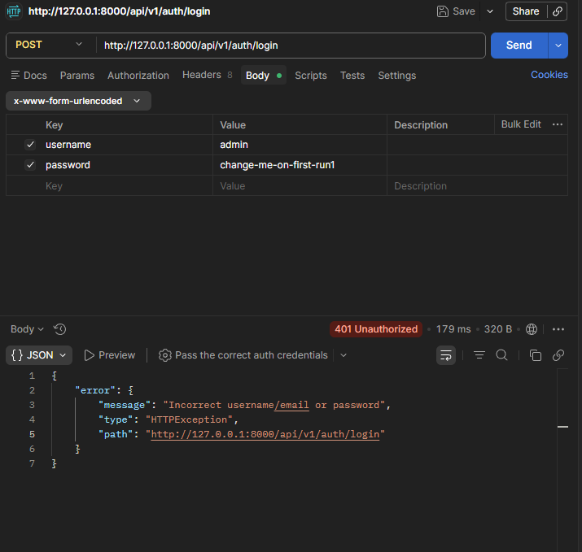

3. Create user as admin (`201`)  
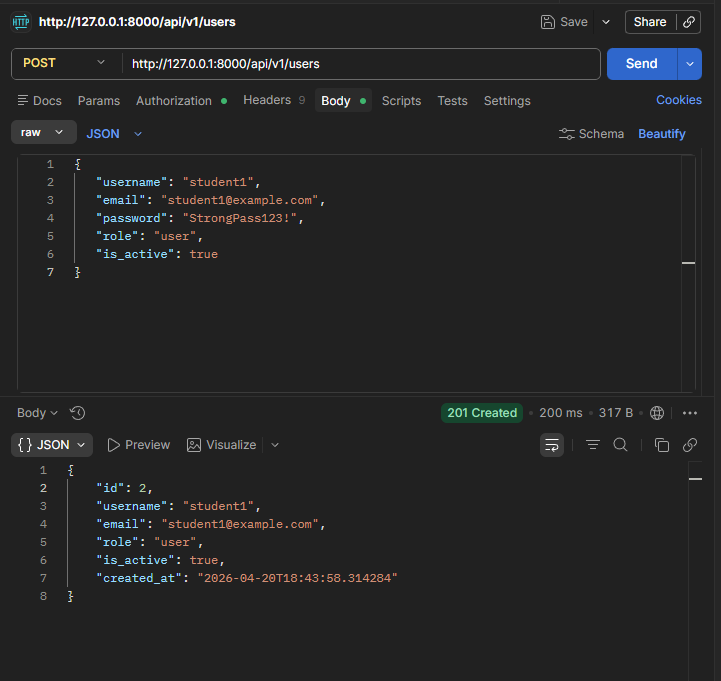

4. Forbidden action as non-admin (`403`)  
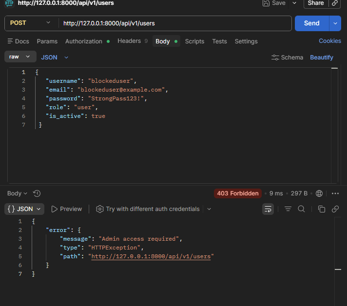

5. Create device (`201`) + list devices (`200`)  
<table>
  <tr>
    <td>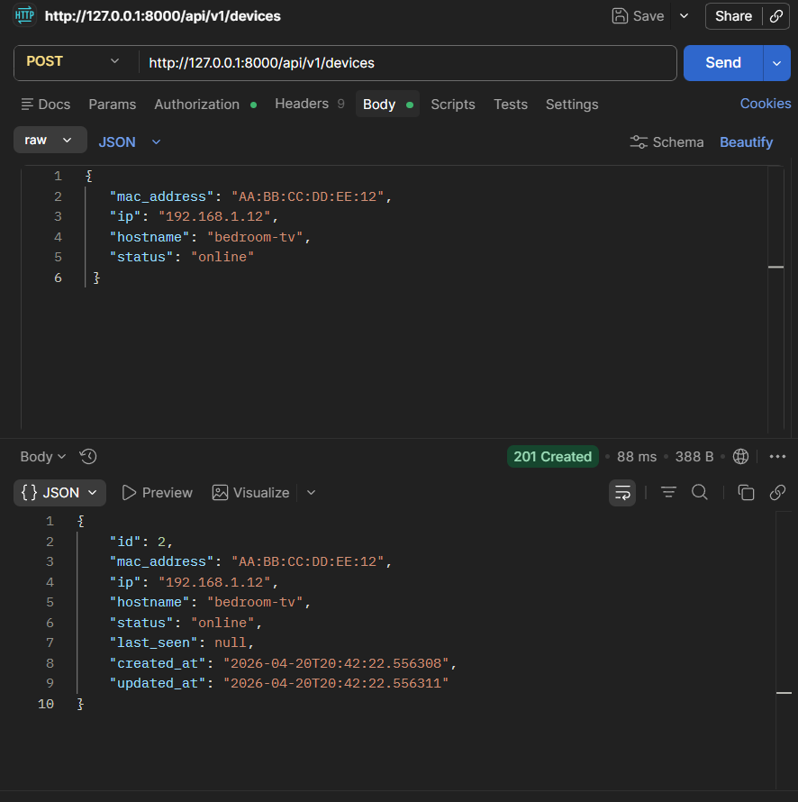</td>
    <td>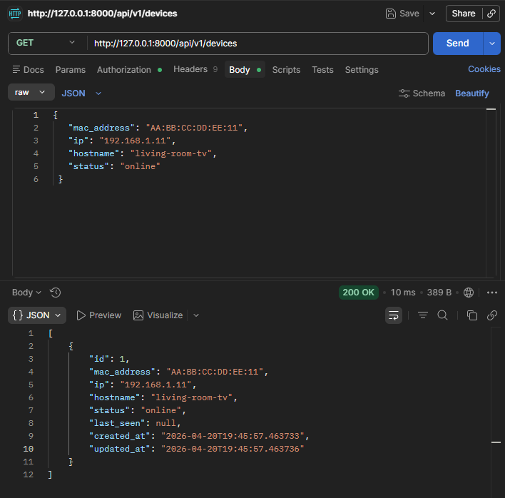</td>
  </tr>
</table>

6. Create alert (`201`) + acknowledge alert via update (`200`)  
<table>
  <tr>
    <td>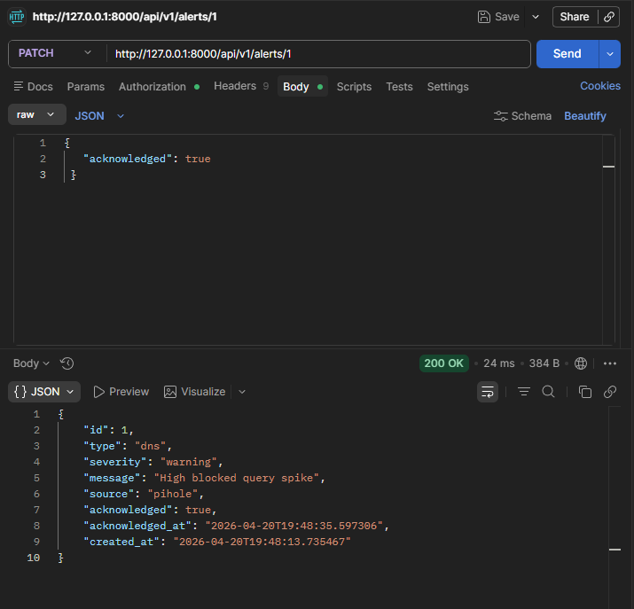</td>
    <td>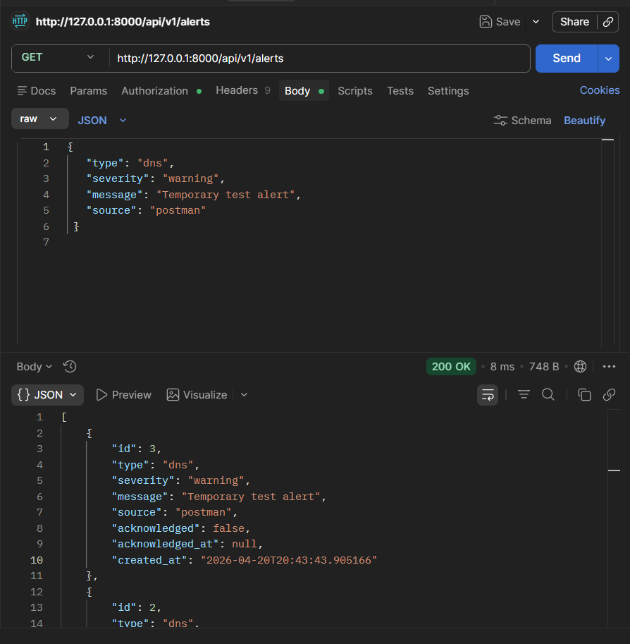</td>
    <td>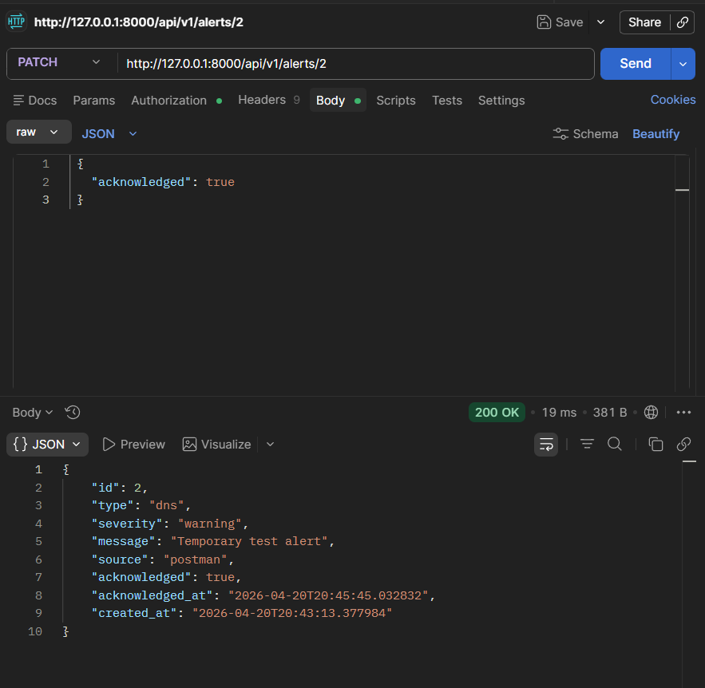</td>
  </tr>
</table>

7. Create VPN peer (`201`) + list peers (`200`)  
<table>
  <tr>
    <td>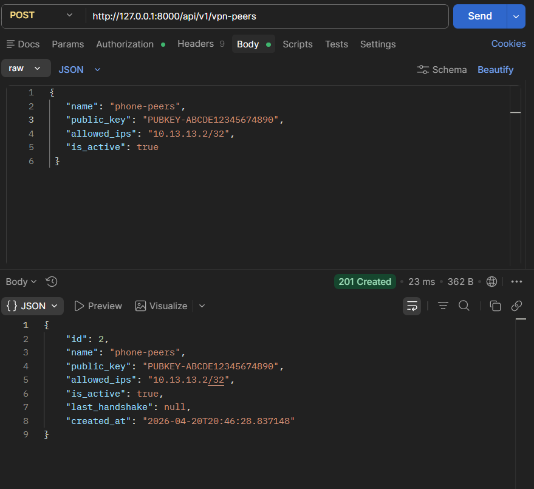</td>
    <td>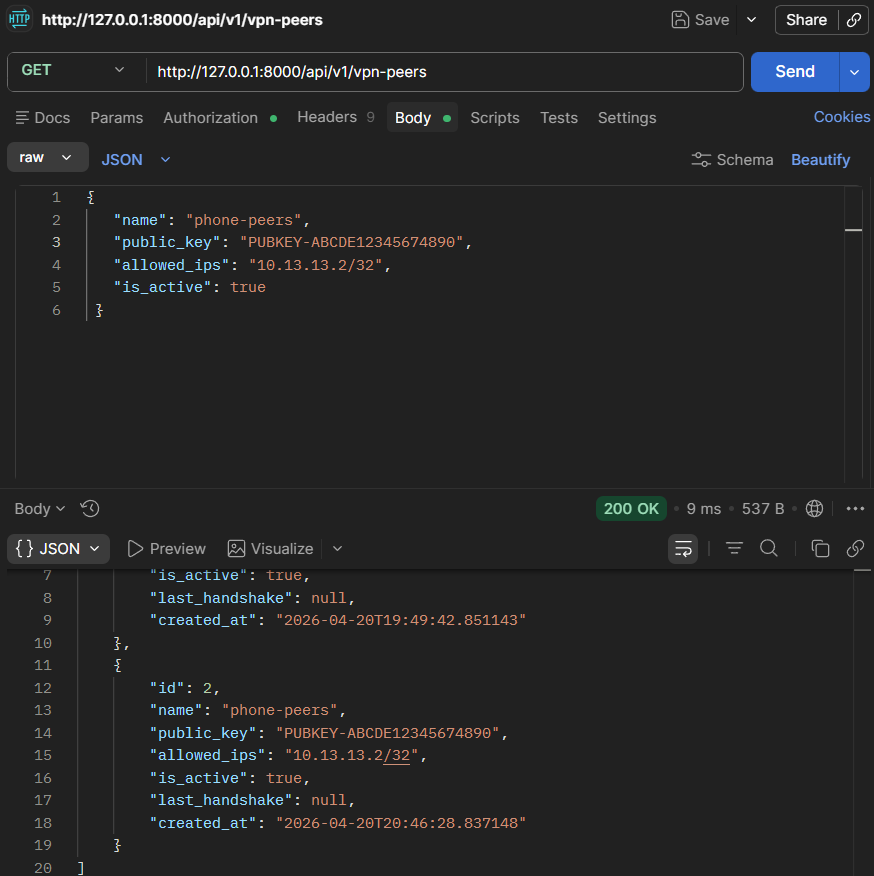</td>
  </tr>
</table>

8. Refresh token (`200`)  
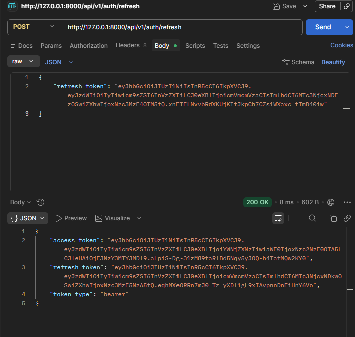

